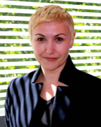
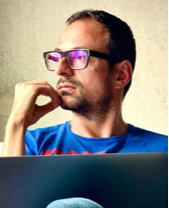

### Project Team

- **Elena Simperl (ES, PI)**
  Leading AI academic, PI of Data Stories, WDAqua, Cleopatra (where the research was conducted). PI of FP7 Render, the project that originally funded Wikidata (2010-2012). Director of research at the Open Data Institute, advises the European Commission on publishing and assuring open data. ES will lead the project, oversee the design of the toolkit, and manage the strategic partnership with the Wikimedia Foundation (WF).

- **Albert Meroño Peñuela (AMP, CoPI)**
  With 10 years of experience in AI research, PI of MuseIT, which uses AI to add audio-visual content to Wikidata, with applications in cultural heritage. AMP will oversee all Wikidata community and be the first point of contact for SRSE.

- **Odinaldo Rodrigues (OR, CoI)**
  An expert in knowledge representation and reasoning, co-director of the UKRI STAI CDT, editor of the J. of Logic and Computation and the Logic J. of the IGPL. OR has extensive software engineering expertise and will be leading our software sustainability work.

- **Jongmo Kim**
  He is an AI backend engineer for the WQT, responsible for tasks such as AI model deployment and inference pipeline development. His research primarily focuses on knowledge graph representation learning, utilizing graph neural networks, generative methods, and large language models.

- **Kholoud Alghamdi**
  Kholoud Alghamdi is a PhD student in the Department of Informatics, where she serves as a key developer of Wikidata Game+, focusing on her innovative recommender systems. She earned her master's degree in Computer Science from the University of Southampton in 2018. Before joining King's College, she worked as a teaching assistant at King Abdulaziz University and as a data analyst in the industry. Her research centers on developing a task recommender system for the human community within community-driven knowledge graphs, with a primary focus on Wikidata.
  

- **Miriam Redi**
  She is a Research Manager at the Wikimedia Foundation and Visiting Research Fellow at King's College London. Formerly, she worked as a Research Scientist at Yahoo Labs in Barcelona and Nokia Bell Labs in Cambridge. She received her PhD from EURECOM, Sophia Antipolis. She conducts research in social multimedia computing, working on fair, interpretable, multimodal machine learning solutions to improve knowledge equity.
  

- **Yiwen Xing**
  She is currently a PhD candidate in Computer Science at King's College London and working UI/UX desinger for the WQT. She holds a Master of Science degree in Data Science from the same institution, achieving a distinction grade. Prior to that, she earned dual Bachelor of Science degrees in Statistics and Applied Psychology from East China Normal University. Yiwen possesses a robust background in Statistics and Data Science, with extensive experience in data analysis and visualization across various domains. She is proficient in both front-end and back-end programming techniques and is adept at developing lightweight web applications.

- **Bohui Zhang**
  Bohui is a PhD student at the Department of Informatics, serving as the main engineer and developer of the EntitySchema Generator. His doctoral research will concentrate on explainable automatic knowledge engineering. The aim is to automate the knowledge engineering process using language model-driven methods and address transparency issues in the knowledge graph lifecycle by bridging the gap between research methods and practical knowledge engineering needs. This involves effectively integrating explainable AI methods into this space. Additionally, he is open to exploring other topics in semantic web and natural language processing.
