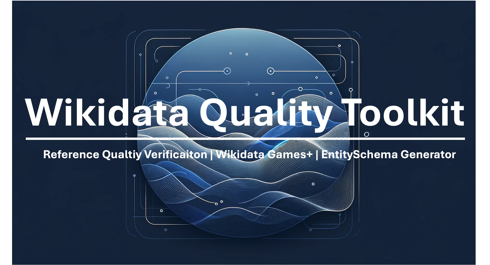

---
# Welcome to WQT Website

The Wikidata Quality Toolkit (WQT) is a comprehensive suite designed to support Wikidata editors and users. It includes tools such as Reference Quality Verification, Wikidata Game+, and EntitySchema Generator as its core components. As Wikidata continues to grow, ensuring its quality becomes a critical concern for both data providers and users. However, due to its large scale, dynamism, and complex data structure, maintaining Wikidata's quality is an increasingly non-trivial task, challenged by the limitations of community-based management.

The WQT introduces a set of AI/ML-based tools aimed at enhancing the quality of Wikidata. By leveraging these toolkits, Wikidata editors are empowered to support the generation and refinement of Wikidata, thereby improving its overall quality. Likewise, Wikidata users are assured access to high-quality information, facilitating more reliable utilization and consumption.

The WQT is open-source, offering data, software, and guidance to the community, researchers, and AI developers, reinforcing its commitment to improving Wikidata's quality and accessibility.

---

  

    <h2>   Reference Quality Verification (RQV)</h2>
    

      
RQV provides an automated pipeline that verifies whether Knowledge Graph triples are supported by their documented sources. It involves text extraction, triple verbalization, sentence selection, and claim verification using rule-based methods and machine learning models. The users can verify the reference quality of specific document or wikidata item by using this tool. Futhermore, this tool supports to verify a batch of documents and wikidata tiems automatically. 

      
 Link coming soon… 

    

  

---
  
  

    <h2> Wikidata Game+</h2>
    
Wikidata Game+ builds upon the Wikidata Game by incorporating a novel recommendation system that provides personalised recommendation items for the editors, relying on both item features and item-editor previous interactions. It utilises users', items' content, and items' relations representations using matrix factorization, ELMo, and TransR embedding techniques. 

    
 Link coming soon… 

   
  

---

  

    <h2>  EntitySchema Generator</h2>
    
There are numerous issues with Wikidata modeling and data quality, with inconsistent modeling of EntitySchemas being one of the most significant challenges nowadays. The EntitySchema generator addresses this by generating reference patterns of entity schemas for specific topics of entities based on Large Language Models (LLMs). By training on both good and bad examples, it can generate reference patterns and evaluate the quality of entity schemas. Additionally, it can modify inconsistent entity schemas based on the generated best patterns, and provide explanations and additional comments leveraging the capabilities of LLMs. 

    
 Link coming soon… 

  

